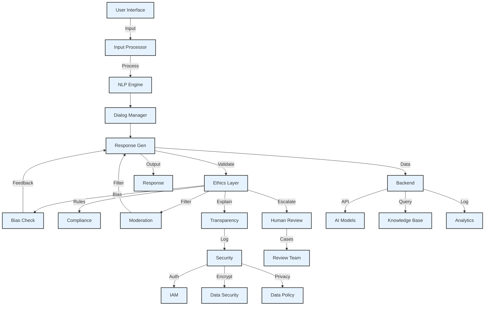
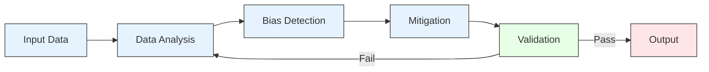
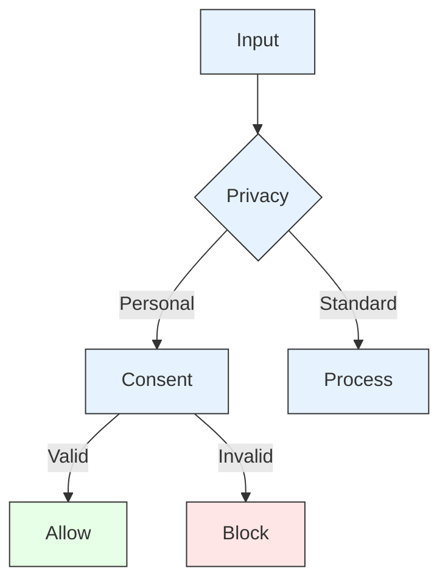
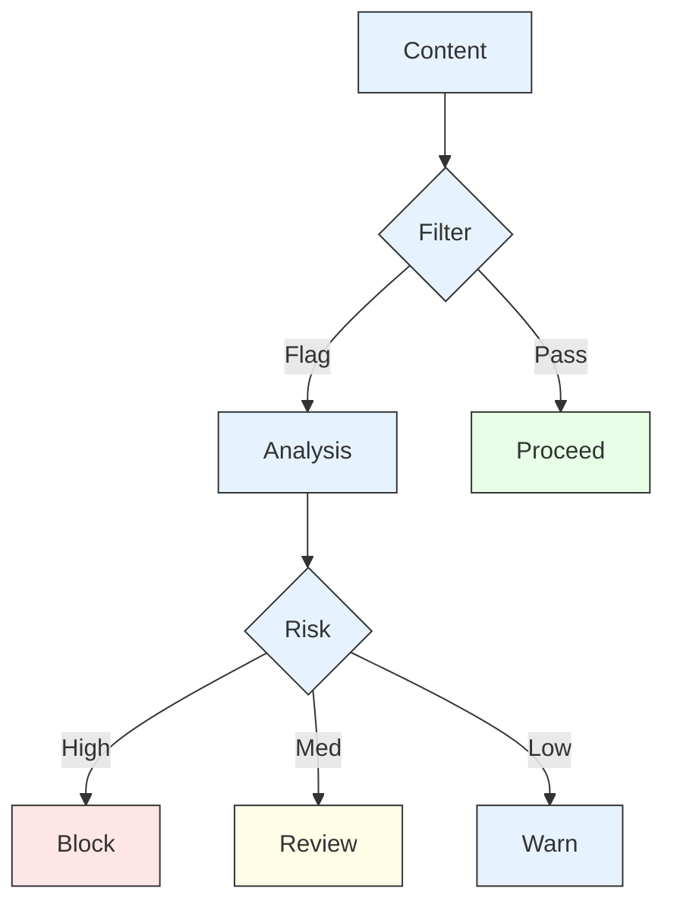
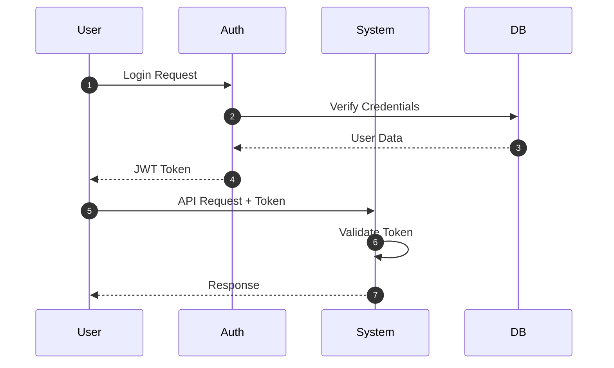
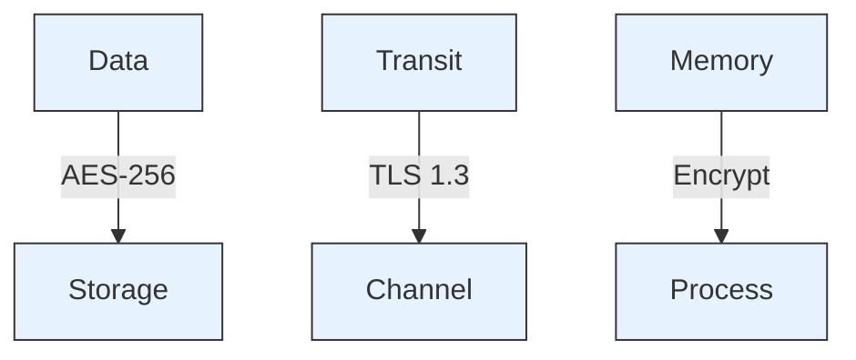

# AI Framework Master Documentation

## Table of Contents
1. [System Architecture](#system-architecture)
2. [Ethical AI Implementation](#ethical-ai-implementation)
3. [Security & Integration](#security-integration)

## System Architecture

### Core System Flow


## Ethical AI Implementation

### Bias Detection Flow


### Compliance Process


### Content Moderation


## Security & Integration

### Authentication Flow


### Data Security


## Implementation Details

### Access Control
```json
{
  "roles": {
    "admin": ["read", "write", "delete", "configure"],
    "operator": ["read", "write", "configure"],
    "analyst": ["read", "analyze"],
    "user": ["read"]
  }
}
```

### Bias Detection
```json
{
  "biasChecks": {
    "gender": ["language", "representation"],
    "ethnicity": ["cultural_context", "stereotypes"],
    "age": ["accessibility", "inclusion"]
  }
}
```

## Deployment Checklist

### Security
- [ ] SSL/TLS setup
- [ ] WAF configuration
- [ ] DDoS protection
- [ ] Key management

### Ethics
- [ ] Bias detection
- [ ] Content filters
- [ ] Compliance rules
- [ ] Audit logging

### Integration
- [ ] API documentation
- [ ] Rate limits
- [ ] Monitoring
- [ ] Backup procedures

## Best Practices

### 1. Security
- End-to-end encryption
- Regular audits
- Access control
- Data protection

### 2. Ethics
- Bias monitoring
- Transparency
- Fair processing
- User privacy

### 3. Performance
- Load balancing
- Caching
- Monitoring
- Error handling

---
*This master documentation is maintained by the Architecture Team*
