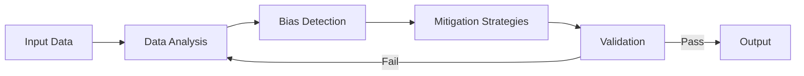
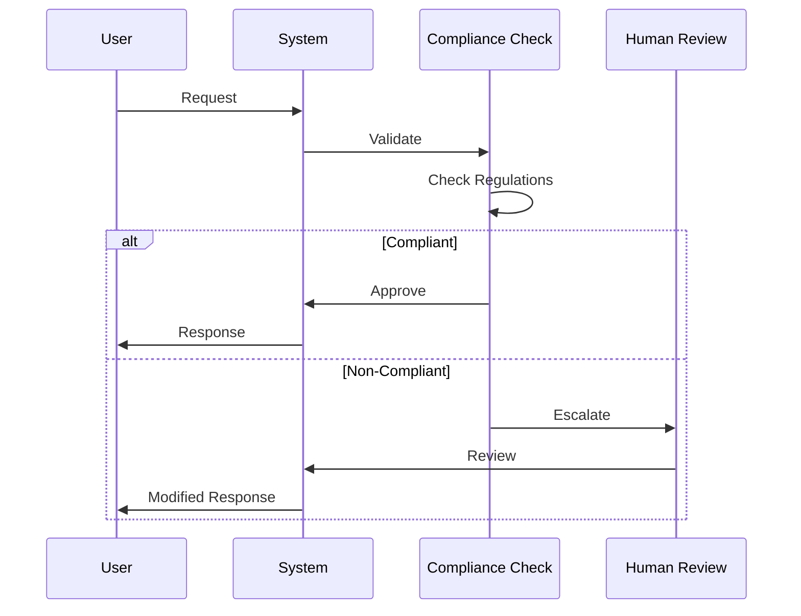
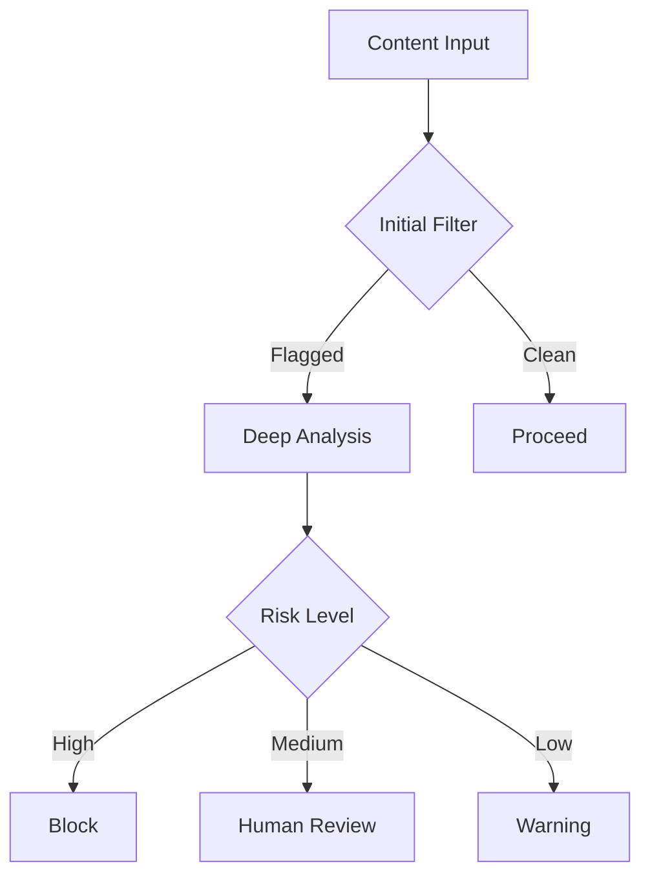
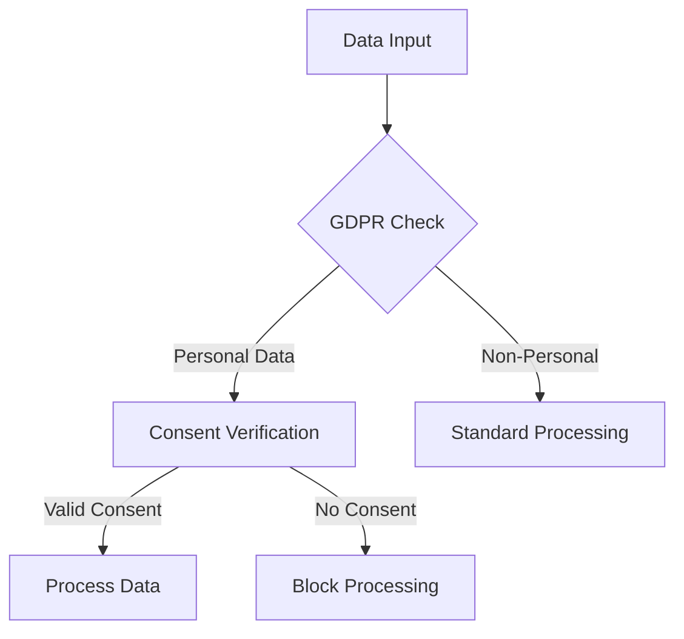

# Ethical AI Implementation Guide

## Overview
This document provides technical implementation details for the Ethical AI Governance Layer of our framework.

## Bias Mitigation System


## Compliance Workflow


## Content Moderation Pipeline


## Technical Implementation Details

### 1. Bias Detection & Mitigation
```json
{
  "biasChecks": {
    "gender": ["language", "representation", "outcomes"],
    "ethnicity": ["cultural_context", "stereotypes"],
    "age": ["accessibility", "inclusion"],
    "socioeconomic": ["access_equity", "opportunity_bias"]
  }
}
```

### 2. Compliance Framework


### 3. Explainability Components
- Model interpretation layers
- Decision path tracking
- Confidence scoring
- Feature importance analysis

## Implementation Checklist

### Bias Mitigation
- [ ] Data diversity analysis
- [ ] Model fairness metrics
- [ ] Regular bias audits
- [ ] Feedback incorporation

### Compliance
- [ ] Data classification
- [ ] Consent tracking
- [ ] Regulatory updates
- [ ] Audit logging

### Content Moderation
- [ ] Content classification
- [ ] Risk scoring
- [ ] Human review interface
- [ ] Appeal process

## Testing & Validation

### Test Scenarios
1. Bias detection accuracy
2. Compliance verification
3. Content moderation effectiveness
4. System performance

### Metrics
- False positive/negative rates
- Response latency
- Escalation rates
- User satisfaction

## Deployment Guidelines

### Prerequisites
- Ethics review board approval
- Data protection impact assessment
- Staff training completion
- System security audit

### Monitoring
- Real-time bias detection
- Compliance violations
- Moderation queue status
- System health metrics

---
*This guide is maintained by the Ethics & Compliance Team*
